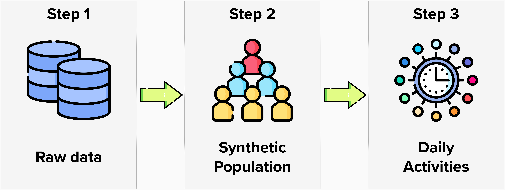

<!-- PROJECT LOGO -->
 

    
    
Icon made by <a href="https://www.freepik.com" title="Freepik">Freepik</a> from <a href="https://www.flaticon.com/" title="Flaticon">www.flaticon.com</a>

    <h1 align="center"> Dynamic Activity Model for Energy</h1>

## Introduction

>In this folder you will find the **Dynamic Activity Model for Energy** (DAME), a spatial microsimulation model (MSM) of people’s presence and their daily activities (e.g. commuting, shopping, education, leisure, etc.) at a high resolution.

>The model will create a synthetic representation of all individuals and households in a study area, combining information from the UK Census of Population as well as a large travel survey (the UK Time Use Survey). In this manner, synthetic individuals will be imbued with socio-demographic characteristics and, importantly, information about how they spend their time during a ‘normal’ day. The model is built on the SPENSER (a spatial MSM for Great Britain3,4) framework and includes people and their activities while present in residential buildings and away from home.

## Main Objective

>This model will enable us to test hypotheses about variations in energy demand and their relationship with household composition and their socio-economic-demographic features.

## Project steps

    
    
 Icons made by <a href="https://www.freepik.com" title="Freepik">Freepik</a> from <a href="https://www.flaticon.com/" title="Flaticon">www.flaticon.com</a>

### Phase 1

> In **Phase 1** all necessary data is identified, collected, cleaned and organized.

In principle, the necessary information are:

* Geographic information
* Socio-economic information
* Household information
* Accommodation information
* Time use information

### Phase 2

> In **Phase 2** the data is used to model a synthetic representation of all individuals in a study area. 

* The model will be built on the SPENSER (a spatial MSM for Great Britain) framework. 
* The synthetic individuals will be imbued with socio-demographic characteristics and, importantly, information about how they spend their time during a ‘normal’ day.

### Phase 3

> In **Phase 3** the synthetic population will be connect with households.

* This model will enable us to test hypotheses about variations in energy demand and their relationship with household composition and their socio-economic-demographic features.
