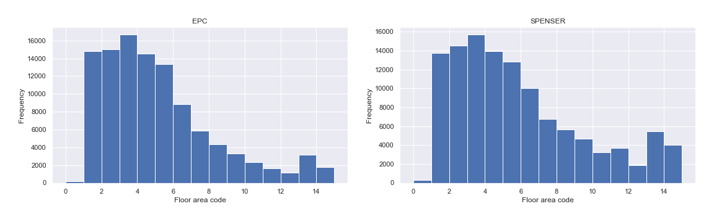
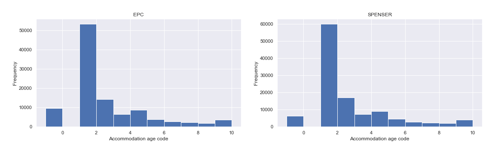

# Enriched Synthetic Population <!-- omit in toc -->

An example for the EPC/SPENSER PSM (Haringey LAD) code can be found [here](EPC_propensity_score_matching.ipynb).

## Propensity Score Matching

In order to enrich the baseline synthetic population the Propensity Score Matching (PSM) method was used. Through the PSM method each baseline individual is matched, based  on the similarity of their characteristics, to an individual in an external dataset.

### General approach

1. Concatenate the baseline and the external datasets.
2. Assign a treatment indicator (0 or 1) for each individual:
   - Baseline individual: Treatment = 0
   - External individual: Treatment = 1
3. Define the covariate matrix (desired matching variables).
4. Define the outcome variable
   - Arbitrary values
     - The treatment effect is beyond the scope of this work, so the chosen values are not important for this work;
5. Determine the Propensity Score (PS) for each individual.
6. Match individuals with similar PS.
7. PSM evaluation.

## Propensity Score Matching : EPC and SPENSER

Energy Performance Certificate (EPC) dataset provides energy performance related data about domestic accommodations.

### Variable selection - Steps 1, 2, 3 and 4

- Treatment values:
  - SPENSER: Treatment = 0
  - EPC: Treatment = 1

- EPC/SPENSER matched variables (covariate matrix) were:
  - Area
  - Tenure
  - Accommodation type

- EPC/SPENSER non-matching variables:
  - Floor area
  - Accommodation age
  - Main heat description (not encoded)

where the matched variables are used to define a Propensity Score for each individual, and the non-matching variables are used to enrich the baseline SPENSER.

### Propensity Score Function - Step 5

To determine the Propensity Score for each individual the [`Causalinference`](https://causalinferenceinpython.org/) package was used. The following code illustrates how to obtain the propensity score if Y (outcome), X (treatment) and Z (covariate matrix) are given:

```python
from causalinference import CausalModel

model = CausalModel(Y, X, Z)
model.est_propensity_s()
PropensityScore = model.propensity['fitted']
```

> Important: the `CausalModel` only work with numerical arrays.

### Matching Process - Step 6

First, for each baseline individual (SPENSER) a list with `n` closest EPC individuals was created. The [`sklearn.neighbors`](https://scikit-learn.org/stable/modules/neighbors.html) is helpful for this task:

```python
from sklearn.neighbors import NearestNeighbors

# create the external neighbors object (p=2 means Euclidean distance)
knn = NearestNeighbors(n_neighbors=n, p=2).fit(EPC["PropensityScore"])

# for each baseline individual, find the nearest external neighbors
distances, indices = knn.kneighbors(SPENSER['PropensityScore'])
```

Then, for each baseline individual, select an external individual from the neighbour list.

- Individuals with closer PS are more likely to be selected.

The following code illustrates how to obtain the match for the individual :

```python
from random import choices

indexEPC = choices(indices[i], weights=W)[0]
```

where  is the weight array defined by

<p align="center">

</p>

where:

- : Propensity Score difference between the baseline individual  and the external neighbour , with .
- : Propensity Score difference between the baseline individual household  and the external neighbour .
- : The number of listed neighbors.
- : Value of the highest desired weight. Here .
- : Value of the lowest desired weight. Here .

The function above is a step like function where the distance between the steps is related with the PS difference between two individuals. The greater the PS difference, the greater the distance between the steps. Finally, equal Propensity Score differences receive the same weight.

> The weight used by the `random.choices` function does not need to be normalized!

## Enriched Synthetic Population Evaluation - Step 7

After find a match for each baseline individual, an internal validation is applied to the non-matching variables (used to enrich the baseline population).

As can be seen below, the variables distribution for the external dataset and the enriched synthetic population are consistent. This is an indication that the synthetic population represents the real population.

### Floor Area
<!--
| Floor Area (A) | A <= 40 m² | 40 < A <= 50 m² | 50 < A <= 60 m² | 60 < A <= 70 m² | 70 < A <= 80 m² | 80 < A <= 90 m² | 90 < A <= 100 m² | 100 < A <= 110 m² | 110 < A <= 120 m² | 120 < A <= 130 m² | 130 < A <= 140 m² | 140 < A <= 150 m² | 150 < A <= 200 m² | 200 < A <= 300 | A > 300 |
|:---:|:---:|:---:|:---:|:---:|:---:|:---:|:---:|:---:|:---:|:---:|:---:|:---:|:---:|:---:|:---:|
| Code | 1 | 2 | 3 | 4 | 5 | 6 | 7 | 8 | 9 | 10 | 11 | 12 | 13 | 14 | 15 |
| EPC | 14.0% | 14.0% | 15.6% | 13.6% | 12.5% | 8.3% | 5.5% | 4.0% | 3.1% | 2.2% | 1.6% | 1.1% | 2.9% | 1.3% | 0.4% |
| SPENSER | 12.1% | 12.5% | 13.5% | 12.0% | 11.1% | 8.6% | 5.8% | 4.9% | 4.0% | 2.8% | 3.2% | 1.6% | 4.7% | 2.5% | 1.0% |
-->



### Accommodation Age

